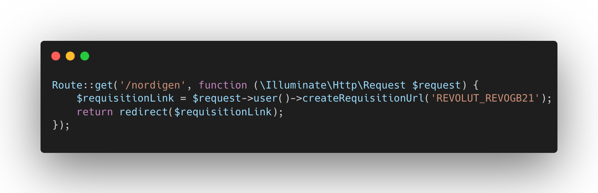

<p align="center">
  
</p>

[![Latest Version on Packagist][ico-version]][link-packagist]
[![Total Downloads][ico-downloads]][link-downloads]

Unofficial Laravel library to integrate Nordigen inside our application and easily get details through User.


## Installation

Via Composer

``` bash
$ composer require hypnodev/laravel-nordigen
```

Publish the configuration with command:
```bash
$ php artisan vendor:publish --provider="Hypnodev\LaravelNordigen\LaravelNordigenServiceProvider" 
```

Add these keys in your .env:
```dotenv
NORDIGEN_SECRET_ID=
NORDIGEN_SECRET_KEY=

LARAVEL_NORDIGEN_SUCCESS_URI="/"
```
_If you don't have yet credentials for Nordigen API, please refer to [User Secrets | Open Banking Portal | Nordigen](https://ob.nordigen.com/user-secrets/)_

## Usage
Add `HasNordigen` trait to your User model
```php
<?php

namespace App\Models;

use Hypnodev\LaravelNordigen\Traits\HasNordigen;
// ...

class User extends Authenticatable
{
    use Notifiable, HasNordigen;
    
    // ...
}
```

This will add `nordigenRequisition`, `createRequisitionUrl`, `nordigenAccounts`, `nordigenAccount`to your user.

Then you can create (and obtain link) requisition for bank (institution) with method:
```php
<?php
auth()->user()->createRequisitionUrl('REVOLUT_REVOGB21');
```

and obtain accounts (wallet) information with these methods:
````php
$accounts = $user->nordigenAccounts();
$account = $user->nordigenAccount($accounts[0]);
dd($account);
````

`nordigenAccounts()` accepts a requisition reference as optional parameter to get specified accounts for a certain bank otherwise it will take accounts for the first requisition available for this user.

## Change log

Please see the [changelog](changelog.md) for more information on what has changed recently.

## Security

If you discover any security related issues, please email me@cristiancosenza.com instead of using the issue tracker.

## Credits

- [Cristian Cosenza][link-author]

## License

Please see the [license file](license.md) for more information.

[ico-version]: https://img.shields.io/packagist/v/hypnodev/laravel-nordigen.svg?style=flat-square
[ico-downloads]: https://img.shields.io/packagist/dt/hypnodev/laravel-nordigen.svg?style=flat-square
[ico-travis]: https://img.shields.io/travis/hypnodev/laravel-nordigen/master.svg?style=flat-square
[ico-styleci]: https://styleci.io/repos/12345678/shield

[link-packagist]: https://packagist.org/packages/hypnodev/laravel-nordigen
[link-downloads]: https://packagist.org/packages/hypnodev/laravel-nordigen
[link-author]: https://github.com/hypnodev
